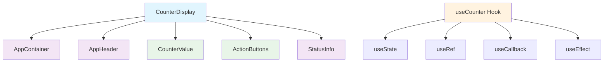

# Оптимизация производительности React компонентов

## Проблема
При обновлении счетчика происходили лишние перерисовки всех компонентов, что снижало производительность приложения.

## Решение

### 1. Разделение на мемоизированные компоненты

Разбили основной компонент `CounterDisplay` на несколько мелких мемоизированных компонентов:

- `AppContainer` - контейнер приложения (не перерисовывается)
- `AppHeader` - заголовок (не перерисовывается)  
- `CounterValue` - отображение значения счетчика (перерисовывается только при изменении значения)
- `ActionButtons` - кнопки действий (перерисовывается только при изменении состояния загрузки)
- `StatusInfo` - информация о статусе (не перерисовывается)

### 2. Использование React.memo

```tsx
export const CounterValue = React.memo<CounterValueProps>(({ value, isLoading, error }) => {
  // Компонент перерисовывается только при изменении props
});
```

### 3. Оптимизация хука useCounter

#### Предотвращение лишних обновлений состояния
```tsx
const lastCounterRef = useRef<number>(0);
const lastErrorRef = useRef<string | null>(null);

// Обновляем только если значение изменилось
if (response.value !== lastCounterRef.current) {
  setCounter(response.value);
  lastCounterRef.current = response.value;
}
```

#### Мемоизация функций
```tsx
const handleIncrement = useCallback(async () => {
  await increment();
}, [increment]);
```

### 4. Мемоизация вычисляемых значений

```tsx
// Мемоизируем значение ошибки для предотвращения лишних перерисовок
const errorMessage = useMemo(() => error?.message || null, [error?.message]);
```

## Результат

✅ **Устранены лишние перерисовки** - компоненты обновляются только при изменении их props  
✅ **Оптимизированы хуки** - состояние обновляется только при реальных изменениях  
✅ **Мемоизированы функции** - предотвращено создание новых функций при каждом рендере  
✅ **Разделена ответственность** - каждый компонент отвечает за свою часть UI  

## Архитектура оптимизированных компонентов



## Производительность

- **Меньше перерисовок** - компоненты обновляются только при необходимости
- **Быстрее рендеринг** - мемоизация предотвращает лишние вычисления
- **Лучший UX** - плавные анимации без лагов
- **Экономия ресурсов** - меньше нагрузки на браузер
