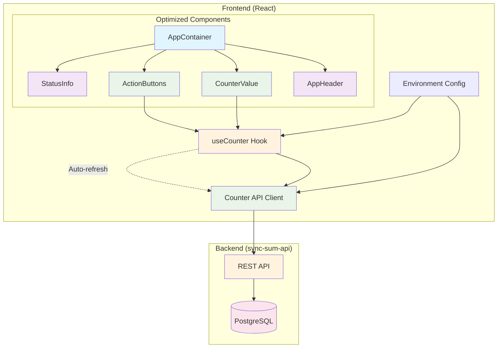
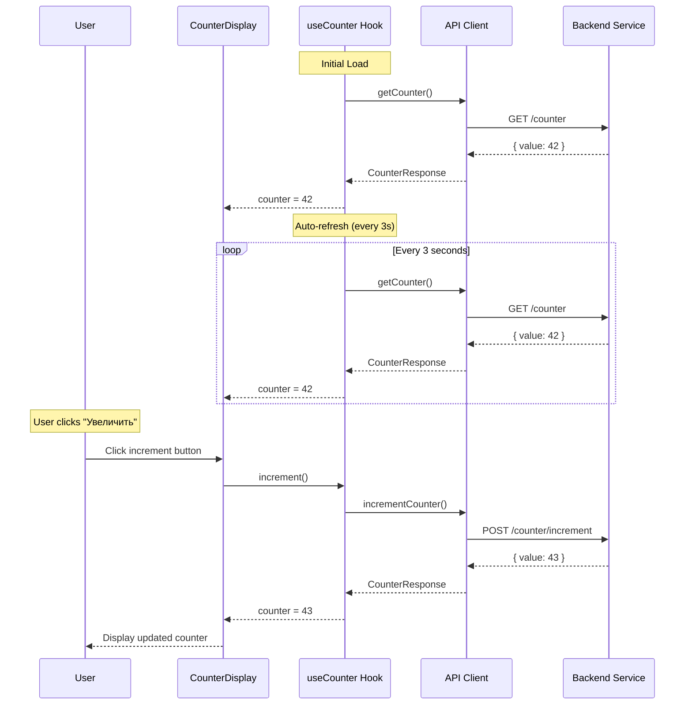

# sync-sum-ui

Современный React UI для сервиса счетчика с автоматическим обновлением и интуитивным интерфейсом.

## Возможности

- 🎯 **Простой интерфейс** — одна кнопка "Увеличить" и отображение текущего значения счетчика
- 🔄 **Автоматическое обновление** — счетчик обновляется каждые 3 секунды без взаимодействия пользователя
- ⚡ **Мгновенная обратная связь** — кнопка увеличивает счетчик с немедленным отображением результата
- 🎨 **Современный дизайн** — красивый UI с анимациями и адаптивной версткой
- 🔧 **Гибкая конфигурация** — настройка API URL и частоты обновления через переменные окружения
- 📱 **Адаптивность** — работает на всех устройствах
- 🚀 **Оптимизированная производительность** — предотвращение лишних перерисовок компонентов

## Архитектура



## Технологический стек

- **React 18** — современная библиотека для создания пользовательских интерфейсов
- **TypeScript** — типизированный JavaScript для надежности кода
- **Vite** — быстрый инструмент сборки и разработки
- **Tailwind CSS** — utility-first CSS фреймворк для стилизации
- **Axios** — HTTP клиент для API запросов
- **Lucide React** — современные иконки
- **ESLint** — линтер для поддержания качества кода

## Структура проекта

```
sync-sum-ui/
├── src/
│   ├── components/          # React компоненты
│   │   ├── CounterDisplay.tsx    # Основной компонент
│   │   ├── AppContainer.tsx      # Контейнер приложения
│   │   ├── AppHeader.tsx         # Заголовок
│   │   ├── CounterValue.tsx      # Отображение счетчика
│   │   ├── ActionButtons.tsx     # Кнопки действий
│   │   └── StatusInfo.tsx        # Информация о статусе
│   ├── hooks/               # Пользовательские хуки
│   │   └── useCounter.ts
│   ├── lib/                 # Утилиты и API клиент
│   │   ├── api.ts
│   │   └── counterApi.ts
│   ├── types/               # TypeScript типы
│   │   └── index.ts
│   ├── main.tsx            # Точка входа приложения
│   └── index.css           # Глобальные стили
├── public/                 # Статические файлы
├── package.json            # Зависимости и скрипты
├── vite.config.ts          # Конфигурация Vite
├── tailwind.config.js      # Конфигурация Tailwind
├── tsconfig.json           # Конфигурация TypeScript
├── env.example             # Пример переменных окружения
├── README.md               # Документация
└── PERFORMANCE.md          # Оптимизация производительности
```

## Поток данных



## Установка и запуск

### Требования

- Node.js 18+ 
- npm или yarn
- Запущенный сервис sync-sum-api

### Установка зависимостей

```bash
npm install
```

### Настройка переменных окружения

Скопируйте файл с примером переменных окружения:

```bash
cp env.example .env
```

Отредактируйте `.env` файл под ваши нужды:

```env
# API Configuration
VITE_API_BASE_URL=http://localhost:8080
VITE_REFRESH_INTERVAL=3000
```

### Запуск в режиме разработки

```bash
npm run dev
```

Приложение будет доступно по адресу `http://localhost:3000`

### Сборка для продакшена

```bash
npm run build
```

Собранные файлы будут в папке `dist/`

### Предварительный просмотр продакшен сборки

```bash
npm run preview
```

## Конфигурация

### Переменные окружения

| Переменная | Описание | По умолчанию |
|------------|----------|--------------|
| `VITE_API_BASE_URL` | Базовый URL API сервиса | `http://localhost:8080` |
| `VITE_REFRESH_INTERVAL` | Интервал автообновления в миллисекундах | `3000` |

### Настройка API

API клиент автоматически подключается к сервису sync-sum-api и использует следующие эндпоинты:

- `GET /counter` — получение текущего значения счетчика
- `POST /counter/increment` — увеличение счетчика на 1

## Компоненты

### Оптимизированная архитектура компонентов

Приложение использует мемоизированные компоненты для предотвращения лишних перерисовок:

#### CounterDisplay
Основной компонент приложения, который координирует работу всех подкомпонентов.

#### AppContainer
Контейнер приложения с градиентным фоном и карточкой. Не перерисовывается.

#### AppHeader
Заголовок приложения "Sync Sum Counter". Не перерисовывается.

#### CounterValue
Отображает текущее значение счетчика, состояние загрузки и ошибки. Перерисовывается только при изменении значения.

#### ActionButtons
Кнопки "Увеличить" и "Обновить". Перерисовывается только при изменении состояния загрузки.

#### StatusInfo
Информация о конфигурации (интервал обновления, API URL). Не перерисовывается.

### useCounter Hook

Оптимизированный пользовательский хук, который управляет:

- Состоянием счетчика с предотвращением лишних обновлений
- Загрузкой данных
- Обработкой ошибок
- Автоматическим обновлением каждые 3 секунды
- Ручным обновлением и инкрементом
- Мемоизацией функций с useCallback
- Отслеживанием изменений с useRef

## API Client

### counterApi

Модуль для взаимодействия с backend API:

- `getCounter()` — получение текущего значения
- `incrementCounter()` — увеличение счетчика
- Автоматическая обработка ошибок
- Типизированные ответы

## Стилизация

Приложение использует Tailwind CSS с кастомными компонентами:

- **Цветовая схема**: Синяя палитра с градиентами
- **Анимации**: Плавные переходы и индикаторы загрузки
- **Адаптивность**: Мобильно-первый подход
- **Доступность**: Поддержка клавиатурной навигации и screen readers

## Разработка

### Доступные скрипты

```bash
# Запуск в режиме разработки
npm run dev

# Сборка для продакшена
npm run build

# Проверка типов TypeScript
npm run type-check

# Линтинг кода
npm run lint

# Исправление ошибок линтера
npm run lint:fix

# Предварительный просмотр сборки
npm run preview
```

### Структура кода

- **Компоненты**: Функциональные компоненты с TypeScript
- **Хуки**: Кастомные хуки для логики состояния
- **API**: Типизированные функции для работы с API
- **Стили**: Utility-first подход с Tailwind CSS

## Обработка ошибок

Приложение включает комплексную обработку ошибок:

- **Сетевые ошибки**: Отображение сообщений о проблемах с подключением
- **Ошибки сервера**: Показ статус-кодов и сообщений от API
- **Таймауты**: Автоматическое прерывание долгих запросов
- **Fallback UI**: Отображение состояния ошибки вместо краша

## Производительность

### Оптимизация перерисовок

Приложение использует современные техники оптимизации React:

- **React.memo**: Все компоненты мемоизированы для предотвращения лишних перерисовок
- **useCallback**: Функции мемоизированы для стабильных ссылок
- **useMemo**: Вычисляемые значения кэшируются
- **useRef**: Отслеживание предыдущих значений для условных обновлений
- **Разделение компонентов**: Каждый компонент отвечает за свою часть UI

### Результаты оптимизации

- **Меньше перерисовок**: Компоненты обновляются только при изменении их props
- **Быстрее рендеринг**: Мемоизация предотвращает лишние вычисления
- **Лучший UX**: Плавные анимации без лагов при автообновлении
- **Экономия ресурсов**: Минимальная нагрузка на браузер

### Автоматическое обновление

- Оптимизировано для минимального потребления ресурсов
- Обновление состояния только при реальных изменениях значений
- Предотвращение лишних API запросов при одинаковых ответах

### Сборка и разработка

- **Vite**: Быстрая сборка и Hot Module Replacement
- **TypeScript**: Проверка типов на этапе компиляции
- **ESLint**: Автоматическая проверка качества кода

## Безопасность

- **Валидация данных**: Проверка типов на уровне TypeScript
- **Санитизация**: Очистка пользовательского ввода
- **HTTPS**: Поддержка защищенных соединений
- **CORS**: Правильная настройка для работы с API

## Тестирование

Для тестирования рекомендуется использовать:

- **Jest** — для unit тестов
- **React Testing Library** — для тестирования компонентов
- **Cypress** — для e2e тестов
- **MSW** — для мокирования API

## Развертывание

### Docker

```dockerfile
FROM node:18-alpine as builder
WORKDIR /app
COPY package*.json ./
RUN npm ci
COPY . .
RUN npm run build

FROM nginx:alpine
COPY --from=builder /app/dist /usr/share/nginx/html
COPY nginx.conf /etc/nginx/nginx.conf
EXPOSE 80
CMD ["nginx", "-g", "daemon off;"]
```

### Nginx конфигурация

```nginx
server {
    listen 80;
    server_name localhost;
    root /usr/share/nginx/html;
    index index.html;

    location / {
        try_files $uri $uri/ /index.html;
    }

    location /api {
        proxy_pass http://sync-sum-api:8080;
        proxy_set_header Host $host;
        proxy_set_header X-Real-IP $remote_addr;
    }
}
```

## Лицензия

MIT

## Дополнительная документация

- [PERFORMANCE.md](./PERFORMANCE.md) - Подробное описание оптимизации производительности
- [env.example](./env.example) - Пример конфигурации переменных окружения

## Поддержка

Для вопросов и предложений создавайте issues в репозитории проекта.
